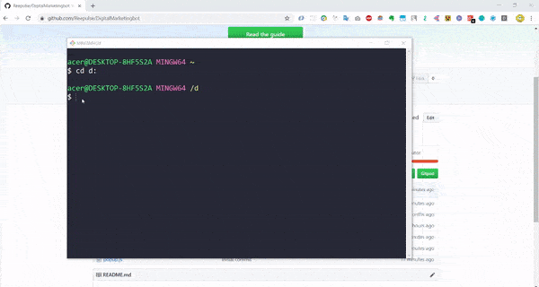
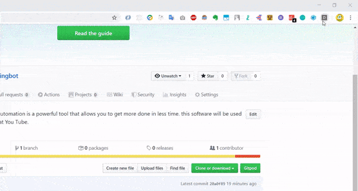

# DigitalMarketingbot

---

This marketing bot allows you to advertise your buisness using youtube comments. This bot makes it easy to post comment on many videos by just a single click. 

Sometimes you can get your customers from comment section, as a lot of people reads comments from their favourite youtube videos and some of them might be interested in your buisness solution, so commenting about your buisness on multiple youtube videos might generate some potental customers for your buisness. 

**Note**: Don't overuse this bot as youtube algorithms don't like bots a lot, youtube might ban you.

---

## Installation

- Clone this repository on your local machine

  ```bash
  git clone https://github.com/Reepulse/DigitalMarketingbot.git
  ```

- Open `Google Chrome` or any `chromium` based browser

- Visit this URL

  ```
  chrome://extensions
  ```

- Click on `Load Unpacked`

- Now in the folder where you have cloned the repository, Select `DigitalMarketingBot`

- Now click on the new `D` added in the toobar



> Installing the bot

---

## Usage

- Click on the D icon on the toolbar, with other extensions.
- Then extension popup will open
- Add the search string ( this will be used to get the videos to comment on), example: Dj snake
- Add the comment which will be posted on the videos
- Select the number of comments you want on different videos.
- Hit the start button.
- This will open a new bot controlled tab, which will comment on videos automatically



> Usage 

---


